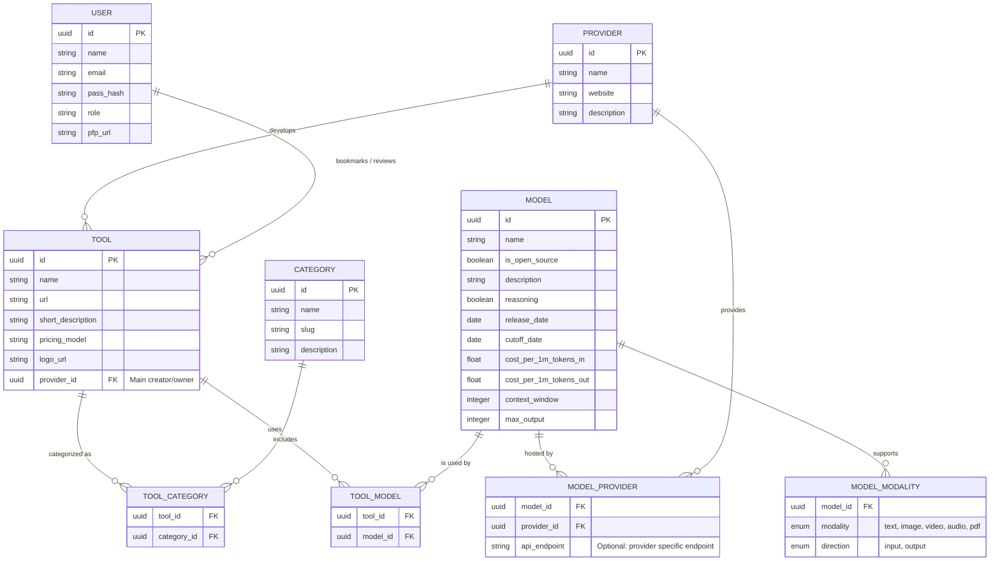

# Database Schema Draft

This schema minimizes the `User` entity and focuses heavily on the core relationships between `Tool`, `Model`, and `Provider`. Because tools can use multiple models, and models can be hosted/provided by multiple companies, we use junction tables to represent those many-to-many relationships.

