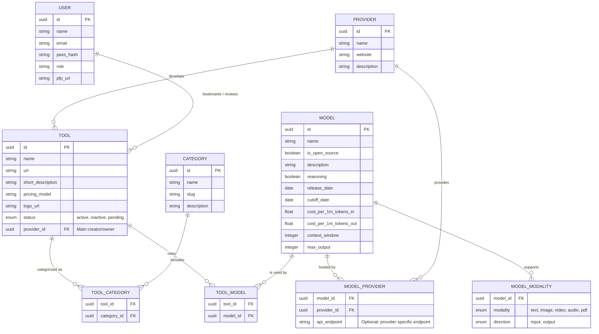

# Database Schema Draft

This schema minimizes the `User` entity and focuses heavily on the core relationships between `Tool`, `Model`, and `Provider`. Because tools can use multiple models, and models can be hosted/provided by multiple companies, we use junction tables to represent those many-to-many relationships.

## Brainstorming & Open Questions

Based on the initial schema, here are the key "pressure points" and questions to address before final implementation:

### 1. The Pricing Paradox
In `TOOL`, we have `string pricing_model`.
- **The Challenge:** AI pricing is rarely a single string (Free, Pro, API usage).
- **Question:** Should we add a `PRICING_PLAN` table to allow users to filter by "Free Tier", "Usage-Based", or "Subscription"?

### 2. Model Versioning & Families
- **The Challenge:** Models like GPT-4 have many versions (`gpt-4-0613`, `gpt-4-turbo`).
- **Question:** Does a `MODEL` record represent the family (Llama 3) or a specific checkpoint? Should we add a `parent_model_id` for self-referencing hierarchy?

### 3. Provider Identity Crisis
- **The Challenge:** Anthropic *creates* Claude, but Amazon Bedrock *hosts* it.
- **Question:** Should the `PROVIDER` table distinguish between **Source Providers** (Creators) and **Service Providers** (Inference/Hosts)?

### 4. Tool-Level Modalities
- **The Challenge:** A tool might use a Multimodal model but only expose "Text to Image" to the user.
- **Question:** Should `TOOL` have its own `TOOL_MODALITY` table to track the user-facing interface?

### 5. Review & Trust (The Heart of the PRD)
- **The Challenge:** The PRD focuses on "Trust through the crowd."
- **Question:** We need a formal `REVIEW` table (Rating, Comment, Use-Case Context) to calculate the "Community Rating" and show "How people use this."

### 6. Searchability (Categories vs. Tags)
- **The Challenge:** Categories like "Productivity" are broad.
- **Question:** Should we add a `TAG` system (Many-to-Many) for more granular discovery (e.g., "summarization", "email-writer")?
