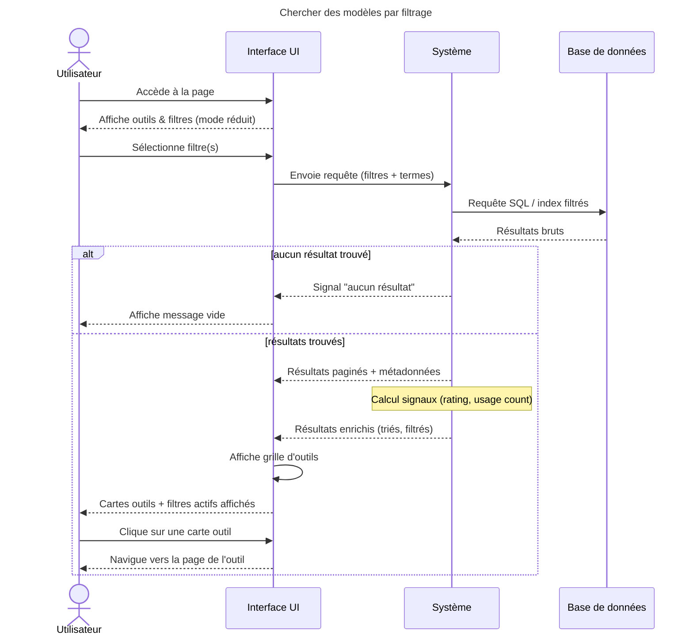

```mermaid
sequenceDiagram
    title Chercher des modèles par filtrage

    actor U as Utilisateur
    participant UI as Interface UI
    participant SYS as Système
    participant DB as Base de données

    U ->> UI : Accède à la page
    UI -->> U : Affiche outils & filtres (mode réduit)
    U ->> UI : Sélectionne filtre(s)
    UI ->> SYS : Envoie requête (filtres + termes)
    SYS ->> DB : Requête SQL / index filtrés
    DB -->> SYS : Résultats bruts

    alt aucun résultat trouvé
        SYS -->> UI : Signal "aucun résultat"
        UI -->> U : Affiche message vide
    else résultats trouvés
        SYS -->> UI : Résultats paginés + métadonnées
        Note over SYS : Calcul signaux (rating, usage count)
        SYS -->> UI : Résultats enrichis (triés, filtrés)
        UI ->> UI : Affiche grille d'outils
        UI -->> U : Cartes outils + filtres actifs affichés
        U ->> UI : Clique sur une carte outil
        UI -->> U : Navigue vers la page de l'outil
    end

```